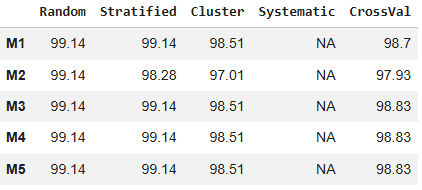

# Credit Card Fraud Detection Using Sampling Techniques

## Assignment Question

Perform an experimental study on a credit card fraud dataset to analyze the impact of different **sampling techniques** on various **machine learning models**.
The objectives of the assignment are to:

1. Use a real-world credit card fraud dataset
2. Apply multiple sampling techniques
3. Train different machine learning models
4. Compare model performance using accuracy
5. Identify the best sampling technique for each model

---

## Problem Statement

Credit card fraud detection is a critical application of machine learning. However, fraud datasets are typically **highly imbalanced**, where fraudulent transactions are very rare compared to legitimate ones.
This imbalance can cause machine learning models to become biased toward the majority class, resulting in poor fraud detection.

The goal of this project is to study how different sampling techniques influence the performance of various machine learning models on an imbalanced credit card fraud dataset.

---

## Dataset Description

* **Dataset Source:**
  [https://raw.githubusercontent.com/AnjulaMehto/Sampling_Assignment/main/Creditcard_data.csv](https://raw.githubusercontent.com/AnjulaMehto/Sampling_Assignment/main/Creditcard_data.csv)

* **Target Column:** `Class`

  * `0` → Non-fraud transaction
  * `1` → Fraud transaction

### Class Distribution

| Class         | Count |
| ------------- | ----- |
| 0 (Non-Fraud) | 763   |
| 1 (Fraud)     | 9     |

The dataset is **highly imbalanced**, with fraud cases representing approximately **1.16%** of the total data.

---

## Sampling Techniques Used

| Code | Sampling Technique  | Description                            |
| ---- | ------------------- | -------------------------------------- |
| S1   | Random Sampling     | Randomly selects a subset of data      |
| S2   | Stratified Sampling | Preserves original class distribution  |
| S3   | Cluster Sampling    | Uses K-Means clustering to select data |
| S4   | Systematic Sampling | Selects every k-th data point          |
| S5   | Cross-Validation    | Uses stratified k-fold validation      |

---

## Machine Learning Models Used

| Code | Model                  |
| ---- | ---------------------- |
| M1   | Logistic Regression    |
| M2   | Decision Tree          |
| M3   | Random Forest          |
| M4   | Support Vector Machine |
| M5   | K-Nearest Neighbors    |

---

## Methodology

1. Load and explore the dataset
2. Separate features and target variable
3. Apply feature scaling using `StandardScaler`
4. Generate datasets using different sampling techniques
5. Train five machine learning models on each sampled dataset
6. Evaluate performance using **accuracy**
7. Apply **Stratified 5-Fold Cross-Validation** for robust evaluation
8. Compare and analyze results

---

## Results

### Accuracy Comparison Table

---

## Analysis

* **Stratified Sampling** provided consistent and reliable performance across most models.
* **Random Forest** achieved the highest accuracy when evaluated using **Cross-Validation**.
* **Cluster Sampling** showed moderate performance but depended on cluster quality.
* **Systematic Sampling failed** due to extreme class imbalance, resulting in samples containing only the majority class.
* **Cross-Validation** produced the most robust and generalizable results.

---

## Limitation of Systematic Sampling

Due to the severe imbalance in the dataset, systematic sampling selected only non-fraud transactions (Class 0).
Since classification models require at least two classes, model training was skipped for systematic sampling.

This demonstrates a known limitation of systematic sampling when applied to highly imbalanced datasets.

---

## Conclusion

This project demonstrates that **sampling techniques significantly affect model performance** in credit card fraud detection.
Stratified sampling and cross-validation are more suitable for imbalanced datasets, while systematic sampling may fail in such scenarios.
Among all combinations tested, **Random Forest with Cross-Validation** achieved the best overall performance.

## Tools and Libraries

* Python
* Pandas
* NumPy
* Scikit-learn

---

## Author

**SALONI SINGH**
Sampling Techniques Assignment
